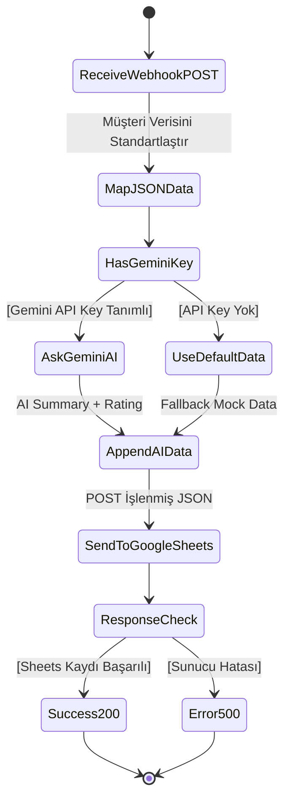

# HW1: Automated CRM Workflow & AI Integration System 

**Author:** Büşra Altın  
**Objective:** Capture data, process it, integrate with an external API (Google Sheets), and apply AI summarization as per HW1 requirements.

---

## 1. How the Solution Meets the HW Requirements

This system accurately satisfies all functional constraints stated in the HW1 specifications:
- **Trigger:** A custom Node.js endpoint (`http://localhost:3000/webhook`) explicitly listening for HTTP `POST` requests acts as the primary Webhook trigger.
- **Logic / Processing Function:** The incoming scattered data is functionally separated and passed through `mapping_function.js`, which sanitizes, standardizes, and injects timestamps. 
- **AI Integration (LLM Completion):** **Google Gemini 2.5 Flash** interprets the inquiry message, extracting an actionable summary and an urgency rating BEFORE being committed to the database.
- **Integration (External API):** Processed and AI-enriched data is forwarded to a Google Apps Script Web App endpoint, which directly populates rows in Google Sheets acting as a CRM.

---

## 2. Walkthrough: The Workflow Structure (Step-by-Step)

The sequence follows the exact required architecture: **Trigger → Processing Function → AI Completion → External API.**

### STEP 1: The Trigger (HTTP POST Webhook)
The entry point into our system is `server.js`, hosting a Node.js `http` server on Port `3000`. 
When a client (or Postman testing form) sends a JSON payload, this step captures it.

**Required Configuration (Postman):**
- Method: `POST`
- URL: `http://localhost:3000/webhook`
- Body (Raw JSON):
```json
{
  "name": "Büşra Altın",
  "email": "busraltin@example.com",
  "company": "Tech Corp",
  "message": "We need an immediate enterprise license for our accounting team, existing system is down!"
}
```

**Execution Code (`server.js` snippet):**
```javascript
const server = http.createServer((req, res) => {
  if (req.method === 'POST' && req.url === '/webhook') {
      // Receives Data stream and parses JSON payload...
```

### STEP 2: Processing Function (Data Mapping)
Once data is captured, it is routed to an isolated handler function `processLeadData()` imported from `mapping_function.js`.

**Action Explained:** 
This function transforms the external unorganized entity into a standardized CRM object. It protects the database consistency by enforcing `email` validation and appending the exact time `captured_at`.

**Code & Configuration (`mapping_function.js`):**
```javascript
function processLeadData(inputData) {
  if (!inputData || !inputData.email) throw new Error("Invalid input: email is required.");
  
  return {
    contact_name: inputData.name || "Unknown",
    contact_email: inputData.email,
    organization: inputData.company || "N/A",
    inquiry_message: inputData.message || "",
    captured_at: new Date().toISOString(),
    lead_status: "New"
  };
}
```

### STEP 3: AI Completion (Gemini 2.5 Analysis)
With cleaned data, the system queries a Large Language Model (Gemini 2.5 Flash API) to classify the lead. 

**Action Explained:** 
Instead of a human reading large paragraphs, the AI gives an instant high-level overview. The system requests a JSON output containing a `"summary"` and a `"rating"` (Low/Medium/High urgency). The `.env` file securely provides the `GEMINI_API_KEY`.

**Code Snippet (`server.js`):**
```javascript
const aiResponse = await fetch(`https://generativelanguage.googleapis.com/v1beta/models/gemini-2.5-flash:generateContent?key=${GEMINI_API_KEY}`, {
  method: "POST",
  headers: { "Content-Type": "application/json" },
  body: JSON.stringify({
    contents: [{
      parts: [{
        text: `Analyze prompt: "${mappedData.inquiry_message}". 1. Short summary. 2. Urgency rating (Low/Medium/High). Format JSON.`
      }]
    }],
    generationConfig: { responseMimeType: "application/json" }
  })
});

// Parsed Output appended to mapped data
mappedData.ai_summary = "Client needs an immediate enterprise license due to system failure.";
mappedData.ai_rating = "High";
```

### STEP 4: Integration & Output (Google Sheets CRM)
The workflow guarantees delivery to our CRM via a Google Apps Script Web App. 

**Action Explained:**
Using JavaScript's `fetch`, the fully enriched and evaluated object (Base Client Data + Timestamp + AI Summary + AI Urgency) is transmitted to the `.env` defined `GOOGLE_SCRIPT_URL`. Google Scripts accepts the payload and uses `auth: anyone` to dynamically append the CRM spreadsheet row without manual tracking.

**Code Snippet:**
```javascript
const sheetResponse = await fetch(process.env.GOOGLE_SCRIPT_URL, {
  method: "POST",
  headers: { "Content-Type": "text/plain" }, // CORS preflight avoidance
  body: JSON.stringify(mappedData)
});
```

---

## 3. Artifacts: Visual Workflow Architecture

Below is the generated UML Activity Diagram representing the decisions and functional transitions of the entire workflow.



## 4. Environment Variables (Configuration)
The project dynamically injects variables for safety. The local `.env` configuration ensures no hardcoded access tokens are leaked to the public GitHub repository:

```env
GEMINI_API_KEY=AIzaSy...Your_Token_Here...
GOOGLE_SCRIPT_URL=https://script.google.com/macros/s/AKfycby...Your_App_Script_ID.../exec
```
