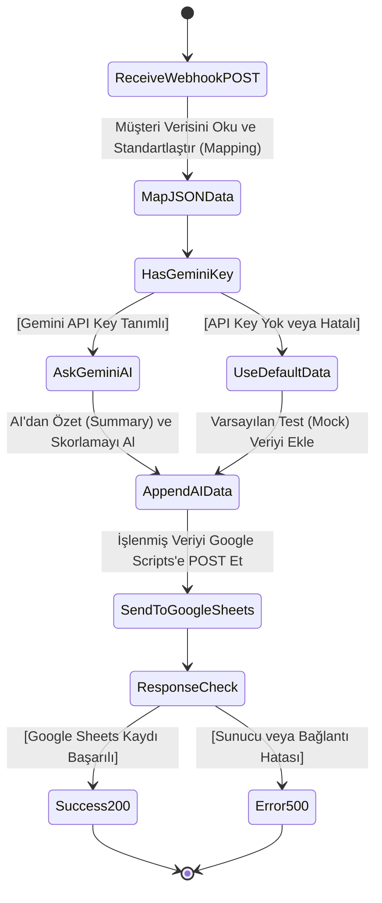

# CRM Projesi - UML Activity Workflow Diagram

Aşağıdaki UML Activity Diagram (Aktivite Diyagramı), `server.js` dosyanızda gerçekleşen webhook sürecinin algoritma adımlarını, koşul bloklarını (choices) ve durum değişimlerini resmi UML formatında göstermektedir.

Github Destekli *Mermaid* formatı ile oluşturulmuştur. Markdown önizlemesi (Preview) olan editörlerde veya [mermaid.live](https://mermaid.live/) üzerinde anında görsel şemaya dönüşür.

